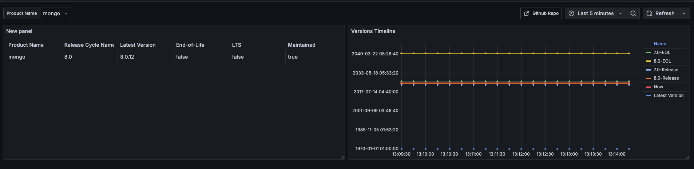

# End-of-Life Exporter

A Prometheus exporter that exposes product versions and their End-of-Life (EOL) dates as metrics using the [endoflife.date](https://endoflife.date) API. Information is fetched only when Prometheus scrapes the `/metrics` endpoint.



## Configuration

Configure products and their release cycles as shown below.

> 💡 Always verify product names on [endoflife.date](https://endoflife.date/). If you don't specify a release, it defaults to the `latest` available one.

```yaml
---
products:
  - name: mongo
    releases:
      - "8.0"
      - "7.0"
  - name: redis
  - name: ubuntu
    all_releases: true
```

## Deployment

### Usage

```bash
Usage: endoflife_exporter [flags]

Flags:
  -h, --help                   Show context-sensitive help.
      --address=":8080"        The address where the server should listen on ($ADDRESS).
      --config="config.yml"    Configuration file path ($CONFIG_FILE)
      --log.format="json"      Set the output format of the logs. Must be "console" or "json" ($LOG_FORMAT).
      --log.level=INFO         Set the log level. Must be "DEBUG", "INFO", "WARN" or "ERROR" ($LOG_LEVEL).
      --log.add-source         Whether to add source file and line number to log records ($LOG_ADD_SOURCE).
```

### Docker Compose

```yaml
---
services:
  endoflife_exporter:
    image: ghcr.io/veerendra2/endoflife_exporter:latest
    container_name: endoflife_exporter
    restart: unless-stopped
    environment:
      ADDRESS: ":8080"
      CONFIG_FILE: "/config.yml"
      LOG_FORMAT: "console"
    volumes:
      - ./config.yml:/config.yml
    ports:
      - 8080:8080
```

```bash
docker compose up -d
```

## Prometheus Configuration

Below is an example scrape configuration for Prometheus.

```yaml
---
scrape_configs:
  - job_name: "endoflife_exporter"
    scrape_interval: 168h # Every week
    scrape_timeout: 2m # If you have a long list of products, you might want to increase the timeout.
    static_configs:
      - targets: ["endoflife_exporter:8080"]
```

### Alerting Rules Example

```yaml
groups:
  - name: endoflife.rules
    rules:
      - alert: ProductVersionEOLReachingSoon
        expr: avg by (product_name, release_cycle_name) (endoflife_eol_from_timestamp_seconds - time()) < (21 * 24 * 3600)
        for: 1h
        labels:
          severity: error
        annotations:
          message: 'Product ''{{ $labels.product_name }}'' release cycle ''{{ $labels.release_cycle_name }}'' reached its End-of-Life on {{ ($value | timestamp "2006-01-02") }}.'
```

## Metrics

The exporter provides four key metrics to track product lifecycle information:

### `endoflife_product_info`

Product release cycle metadata with EOL status, LTS support, and maintenance state as labels.

**Labels:**

- `is_eol`: Whether the release cycle has reached end-of-life
- `is_lts`: Whether this is a Long-Term Support (LTS) release
- `is_maintained`: Whether the release is still receiving any form of support
- `latest_version`: The most recent patch/minor version (e.g., "8.0.12")
- `product_name`: Product identifier (e.g., "mongo", "ubuntu")
- `release_cycle_name`: Release cycle identifier (e.g., "8.0", "22.04")

**Use case:** Query product metadata and filter by support status

```prometheus
endoflife_product_info{is_eol="false",is_lts="false",is_maintained="true",latest_version="8.0.12",product_name="mongo",release_cycle_name="8.0"} 1
```

---

### `endoflife_latest_version_timestamp_seconds`

Release date of the latest version in that release cycle (Unix timestamp).

**Labels:**

- `product_name`: Product identifier
- `release_cycle_name`: Release cycle identifier
- `latest_version`: The version number (e.g., "8.0.12")

**Use case:** Track how recently a release cycle received updates. Useful for identifying stale or actively maintained versions.

```prometheus
endoflife_latest_version_timestamp_seconds{product_name="mongo",release_cycle_name="8.0",latest_version="8.0.12"} 1730419200
```

---

### `endoflife_release_cycle_timestamp_seconds`

Initial release date when the release cycle was first published (Unix timestamp).

**Labels:**

- `product_name`: Product identifier
- `release_cycle_name`: Release cycle identifier

**Use case:** Determine the age of a release cycle. Helps in planning version upgrades based on release maturity.

```prometheus
endoflife_release_cycle_timestamp_seconds{product_name="mongo",release_cycle_name="8.0"} 1722297600
```

---

### `endoflife_eol_from_timestamp_seconds`

End-of-life date when support for the release cycle ends (Unix timestamp).

**Labels:**

- `product_name`: Product identifier
- `release_cycle_name`: Release cycle identifier

**Use case:** Alert on approaching EOL dates and plan migrations. A value of `0` or far-future date (2050-01-01) indicates no EOL date is set.

```prometheus
endoflife_eol_from_timestamp_seconds{product_name="mongo",release_cycle_name="8.0"} 1893456000
```

---

### Example Queries

**Find products approaching EOL (within 21 days):**

```promql
(endoflife_eol_from_timestamp_seconds - time()) < (21 * 24 * 3600)
```

**List all LTS versions still maintained:**

```promql
endoflife_product_info{is_lts="true", is_maintained="true"}
```

**Find versions not updated in the last 6 months:**

```promql
(time() - endoflife_latest_version_timestamp_seconds) > (180 * 24 * 3600)
```

## Development

Install [task](https://taskfile.dev/docs/installation)

```bash
go mod tidy

# Install dependencies
task gen

# Run tests
task test

# List all tasks
task --list
task: Available tasks for this project:
* all:                   Run comprehensive checks: format, lint, security and test
* build:                 Build the application binary for the current platform
* build-docker:          Build Docker image
* build-platforms:       Build the application binaries for multiple platforms and architectures
* fmt:                   Formats all Go source files
* gen:                   Generates Go types from OAPI spec      (aliases: generate)
* install:               Install required tools and dependencies
* lint:                  Run static analysis and code linting using golangci-lint
* run:                   Runs the main application
* security:              Run security vulnerability scan
* test:                  Runs all tests in the project      (aliases: tests)
* vet:                   Examines Go source code and reports suspicious constructs
```

Update endoflife OpenAPI Spec

- Check https://endoflife.date/docs/api/v1/ for changes.
- Update pkg/endoflife/openapi.yaml if needed and run `task gen` again.
- The upstream OpenAPI spec has a type mismatch: `isEoes` is defined as `string` but the API returns `boolean`
  - **Workaround**: Before running `task gen`, manually change the type at [line 564 in openapi.yaml](./pkg/endoflife/openapi.yaml#L564):
    ```yaml
    isEoes:
      type: boolean # Changed from 'string'
      nullable: true
    ```
